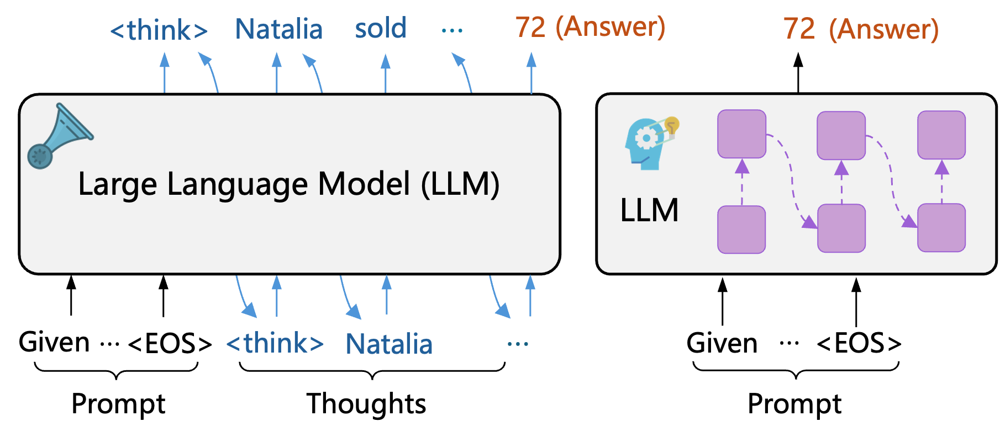

<div align="center">
<h1> Reasoning Beyond Language: A Comprehensive Survey on Latent Chain-of-Thought Reasoning</h1> 
</div>

<div align="center">
<b>Xinghao Chen</b><sup>1,2</sup>,
<b>Anhao Zhao</b><sup>2</sup>,
<b>Heming Xia</b><sup>1</sup>,
<b>Xuan Lu</b><sup>2</sup>,
<b>Hanlin Wang</b><sup>1</sup>,
</div>
<div align="center">
<b>Yanjun Chen</b><sup>1,2</sup>,
<b>Wei Zhang</b><sup>2</sup>,
<b>Jian Wang</b><sup>1</sup>,
<b>Wenjie Li</b><sup>1</sup>,
<b>Xiaoyu Shen</b><sup>2</sup>
</div>

<div align="center">
<sup>1</sup>Department of Computing, The Hong Kong Polytechnic University
</div>
<div align="center">
<sup>2</sup>Ningbo Digital Twin Institute, Eastern Institute of Technology, Ningbo, China
</div>



This repository contains a regularly updated paper list for **Latent CoT Reasoning**.

<p align="center">
<a href="https://arxiv.org/abs/2505.16782">
  </a> 
<a href="https://awesome.re">
  </a>
<a href="https://opensource.org/licenses/Apache-2.0">
  </a> 
<a href="https://github.com/EIT-NLP/Awesome-Latent-CoT/pulls">
    </a>

</p>

<p align="center"><em>
Whereof one cannot speak, thereof one must be silent.
-- Ludwig Wittgenstein
</em></p>

Reasoning in latent space shifts the way AI models think, moving beyond language tokens to represent thought processes in a more abstract, non-language space. Just as humans often think without words, latent space allows for more flexible and efficient reasoning.

### Key advantages include:
1. **Richer Thought Representation**: Latent space captures complex, non-verbal thoughts that language alone can't express.
2. **Lower Latency**: It allows for higher information density, reducing the need for token-based decoding and speeding up reasoning.

This approach brings AI closer to human-like cognition, enabling faster, more flexible, and powerful models for real-world tasks.

## Updates

- 2025-05-22: 📝 The survey is now available on [arXiv](https://arxiv.org/abs/2505.16782)!
- 2025-02-16: 🚀 Latent CoT Repo launched!

## Content

- [Keywords Convention](#keywords-convention)
- [Papers](#papers)
    - [Token-wise Strategies](#token-wise-strategies)
        - [Discrete Tokens](#discrete-tokens)
        - [Continuous Tokens](#continuous-tokens)
    - [Internal Mechanisms](#internal-mechanisms)
        - [Structural CoT](#structural-cot)
        - [Representational CoT](#representational-cot)
    - [Analysis and Interpretability](#analysis-and-interpretability)
    - [Applications and Future Directions](#applications-and-future-directions)
- [Resources](#resources)
- [Acknowledgements](#acknowledgements)
- [Citation](#citation)

## Keywords Convention

 Abbreviation

 Conference

 Main Features

## Papers

### Token-wise Strategies

#### Discrete Tokens

- **Think before you speak: Training language models with pause tokens**  
  *Sachin Goyal,Ziwei Ji, Ankit Singh Rawat, Aditya Krishna Menon, Sanjiv Kumar, Vaishnavh Nagarajan*. [[pdf](https://arxiv.org/pdf/2310.02226)], 2023.10.   
- **Guiding Language Model Reasoning with Planning Tokens**  
  *Xinyi Wang, Lucas Caccia, Oleksiy Ostapenko, Xingdi Yuan, William Yang Wang, Alessandro Sordoni*. [[pdf](https://arxiv.org/pdf/2310.05707)], [[code](https://github.com/WANGXinyiLinda/planning_tokens)], 2023.10.  
- **Thinking Tokens for Language Modeling**  
  *David Herel, Tomas Mikolov*. [[pdf](https://arxiv.org/pdf/2405.08644)],  2024.05.  
- **Let's think dot by dot: Hidden computation in transformer language models**  
  *Jacob Pfau, William Merrill, Samuel R. Bowman*. [[pdf](https://arxiv.org/pdf/2404.15758)], [[code](https://github.com/JacobPfau/fillerTokens)], 2024.04.  
- **Quiet-STaR: Language Models Can Teach Themselves to Think Before Speaking**  
  *Eric Zelikman, Georges Harik, Yijia Shao, Varuna Jayasiri, Nick Haber, Noah D. Goodman*. [[pdf](https://arxiv.org/pdf/2403.09629)], 2024.03.   
- **Reasoning to Learn from Latent Thoughts**  
  *Yangjun Ruan, Neil Band, Chris J. Maddison, Tatsunori Hashimoto*. [[pdf](https://arxiv.org/pdf/2503.18866)], [[code](https://github.com/ryoungj/BoLT)], 2025.03.  
- **Mining Hidden Thoughts from Texts: Evaluating Continual Pretraining with Synthetic Data for LLM Reasoning**  
  *Yoichi Ishibashi, Taro Yano, Masafumi Oyamada*. [[pdf](https://arxiv.org/pdf/2505.10182)], 2025.03.  
- **Disentangling Memory and Reasoning Ability in Large Language Models**  
  *Mingyu Jin, Weidi Luo, Sitao Cheng, Xinyi Wang, Wenyue Hua, Ruixiang Tang, William Yang Wang, Yongfeng Zhang*. [[pdf](https://arxiv.org/pdf/2411.13504)], [[code](https://github.com/MingyuJ666/Disentangling-Memory-and-Reasoning)], 2024.11. 
- **Token Assorted: Mixing Latent and Text Tokens for Improved Language Model Reasoning**  
  *DiJia Su, Hanlin Zhu, Yingchen Xu, Jiantao Jiao, Yuandong Tian, Qinqing Zheng*. [[pdf](https://arxiv.org/pdf/2502.03275)], 2025.02.   
- **Latent Preference Coding: Aligning Large Language Models via Discrete Latent Codes**  
  *Zhuocheng Gong, Jian Guan, Wei Wu, Huishuai Zhang, Dongyan Zhao*. [[pdf](https://arxiv.org/pdf/2505.04993)], 2025.02.   
- **Efficient Pretraining Length Scaling**  
  *Bohong Wu, Shen Yan, Sijun Zhang, Jianqiao Lu, Yutao Zeng, Ya Wang, Xun Zhou*. [[pdf](https://arxiv.org/pdf/2504.14992)], 2025.04.   

#### Continuous Tokens 

- **Training Large Language Models to Reason in a Continuous Latent Space**  
  *Shibo Hao, Sainbayar Sukhbaatar, DiJia Su, Xian Li, Zhiting Hu, Jason Weston, Yuandong Tian*. [[pdf](https://arxiv.org/pdf/2412.06769)], [[code](https://github.com/facebookresearch/coconut)], 2024.12.  
- **Compressed Chain of Thought: Efficient Reasoning Through Dense Representations**  
  *Jeffrey Cheng, Benjamin Van Durme*. [[pdf](https://arxiv.org/pdf/2412.13171)], 2024.12.   
- **Expediting and Elevating Large Language Model Reasoning via Hidden Chain-of-Thought Decoding**  
  *Tianqiao Liu, Zui Chen, Zitao Liu, Mi Tian, Weiqi Luo*. [[pdf](https://arxiv.org/pdf/2409.08561)], 2024.09.   
- **LightThinker: Thinking Step-by-Step Compression**  
  *Jintian Zhang, Yuqi Zhu, Mengshu Sun, Yujie Luo, Shuofei Qiao, Lun Du, Da Zheng, Huajun Chen, Ningyu Zhang*. [[pdf](https://arxiv.org/pdf/2502.15589)], 2025.02.  
- **CODI: Compressing Chain-of-Thought into Continuous Space via Self-Distillation**  
  *Zhenyi Shen, Hanqi Yan, Linhai Zhang, Zhanghao Hu, Yali Du, Yulan He*. [[pdf](https://arxiv.org/pdf/2502.21074)], 2025.02.  
- **SoftCoT: Soft Chain-of-Thought for Efficient Reasoning with LLMs**  
  *Yige Xu, Xu Guo, Zhiwei Zeng, Chunyan Miao*. [[pdf](https://arxiv.org/pdf/2502.12134)], 2025.02.  
- **SoftCoT++: Test-Time Scaling with Soft Chain-of-Thought Reasoning**  
  *Yige Xu, Xu Guo, Zhiwei Zeng, Chunyan Miao*. [[pdf](https://arxiv.org/pdf/2505.11484)], 2025.05.  
- **LLM Pretraining with Continuous Concepts**  
  *Jihoon Tack, Jack Lanchantin, Jane Yu, Andrew Cohen, Ilia Kulikov, Janice Lan, Shibo Hao, Yuandong Tian, Jason Weston, Xian Li*. [[pdf](https://arxiv.org/pdf/2502.08524)], [[code](https://github.com/facebookresearch/RAM/tree/main/projects/cocomix)], 2025.02.   
- **Soft Thinking: Unlocking the Reasoning Potential of LLMs in Continuous Concept Space**  
  *Zhen Zhang, Xuehai He, Weixiang Yan, Ao Shen, Chenyang Zhao, Shuohang Wang, Yelong Shen, Xin Eric Wang*. [[pdf](https://arxiv.org/pdf/2505.15778)], [[code](https://github.com/eric-ai-lab/Soft-Thinking)], 2025.05.   
- **Think Silently, Think Fast: Dynamic Latent Compression of LLM Reasoning Chains**  
  *Wenhui Tan, Jiaze Li, Jianzhong Ju, Zhenbo Luo, Jian Luan, Ruihua Song*. [[pdf](https://arxiv.org/pdf/2505.16552)], [[code](https://colar-latent-reasoning.github.io/)], 2025.05.   
- **Hybrid Latent Reasoning via Reinforcement Learning**  
  *Jihoon Tack, Jack Lanchantin, Jane Yu, Andrew Cohen, Ilia Kulikov, Janice Lan, Shibo Hao, Yuandong Tian, Jason Weston, Xian Li*. [[pdf](https://arxiv.org/pdf/2502.08524)], [[code](https://github.com/facebookresearch/RAM/tree/main/projects/cocomix)], 2025.05.   
- **Seek in the Dark: Reasoning via Test-Time Instance-Level Policy Gradient in Latent Space**  
  *Zhenrui Yue, Bowen Jin, Huimin Zeng, Honglei Zhuang, Zhen Qin, Jinsung Yoon, Lanyu Shang, Jiawei Han, Dong Wang*. [[pdf](https://arxiv.org/pdf/2505.13308)], [[code](https://github.com/Yueeeeeeee/HRPO)], 2025.05.   
- **Enhancing Latent Computation in Transformers with Latent Tokens**  
  *Yuchang Sun, Yanxi Chen, Yaliang Li, Bolin Ding*. [[pdf](https://arxiv.org/pdf/2505.12629)], [[code](https://github.com/Yueeeeeeee/HRPO)], 2025.05.  

### Internal Mechanisms

#### Structural CoT

- **CoTFormer: A Chain-of-Thought Driven Architecture with Budget-Adaptive Computation Cost at Inference**   
  *Amirkeivan Mohtashami, Matteo Pagliardini, Martin Jaggi*. [[pdf](https://arxiv.org/abs/2310.10845)], 2024.08.  
- **Scaling up Test-Time Compute with Latent Reasoning: A Recurrent Depth Approach**  
  *Jonas Geiping, Sean McLeish, Neel Jain, John Kirchenbauer, Siddharth Singh, Brian R. Bartoldson, Bhavya Kailkhura, Abhinav Bhatele, Tom Goldstein*. [[pdf](https://arxiv.org/pdf/2502.05171)], [[code](https://github.com/seal-rg/recurrent-pretraining)], [[model](https://huggingface.co/tomg-group-umd/huginn-0125)], 2025.02.   
- **Enhancing Auto-regressive Chain-of-Thought through Loop-Aligned Reasoning**   
  *Qifan Yu, Zhenyu He, Sijie Li, Xun Zhou, Jun Zhang, Jingjing Xu, Di He*. [[pdf](https://arxiv.org/pdf/2502.08482)], [[code](https://github.com/qifanyu/RELAY)], 2025.02.  
- **Inner Thinking Transformer: Leveraging Dynamic Depth Scaling to Foster Adaptive Internal Thinking**  
  *Yilong Chen, Junyuan Shang, Zhenyu Zhang, Yanxi Xie, Jiawei Sheng, Tingwen Liu, Shuohuan Wang, Yu Sun, Hua Wu, Haifeng Wang*. [[pdf](https://arxiv.org/pdf/2502.13842)], 2025.02.  
- **Reasoning with Latent Thoughts: On the Power of Looped Transformers**  
  *Nikunj Saunshi, Nishanth Dikkala, Zhiyuan Li, Sashank J. Reddi, Sanjiv Kumar*. [[pdf](https://arxiv.org/pdf/2502.17416)], 2025.01.  
- **System-1.5 Reasoning: Traversal in Language and Latent Spaces with Dynamic Shortcuts**  
  *Xiaoqiang Wang, Suyuchen Wang, Yun Zhu, Bang Liu*. [[pdf](https://arxiv.org/pdf/2505.18962)], 2025.05.  
- **Pretraining Language Models to Ponder in Continuous Space**  
  *Boyi Zeng, Shixiang Song, Siyuan Huang, Yixuan Wang, He Li, Ziwei He, Xinbing Wang, Zhiyu Li, Zhouhan Lin*. [[pdf](https://arxiv.org/pdf/2505.20674)], 2025.05.  

#### Representational CoT

- **Implicit Chain of Thought Reasoning via Knowledge Distillation**  
  *Yuntian Deng, Kiran Prasad, Roland Fernandez, Paul Smolensky, Vishrav Chaudhary, Stuart Shieber*. [[pdf](https://arxiv.org/pdf/2311.01460)], [[code](https://github.com/da03/implicit_chain_of_thought/)], 2023.11.  
- **From Explicit CoT to Implicit CoT: Learning to Internalize CoT Step by Step**  
  *Yuntian Deng, Yejin Choi, Stuart Shieber*. [[pdf](https://arxiv.org/pdf/2405.14838)], [[code](https://github.com/da03/Internalize_CoT_Step_by_Step)], 2024.05.  
- **Distilling System 2 into System 1**   
  *Ping Yu, Jing Xu, Jason Weston, Ilia Kulikov*. [[pdf](https://arxiv.org/pdf/2407.06023)], 2024.06.  

### Analysis and Interpretability

- **On the Biology of a Large Language Model**  
  *Anthropic*. [[pdf](https://transformer-circuits.pub/2025/attribution-graphs/biology.html)], 2025.03. 
- **Towards a Mechanistic Interpretation of Multi-Step Reasoning Capabilities of Language Models**  
  *Yifan Hou, Jiaoda Li, Yu Fei, Alessandro Stolfo, Wangchunshu Zhou, Guangtao Zeng, Antoine Bosselut, Mrinmaya Sachan*. [[pdf](https://arxiv.org/pdf/2310.14491)], 2023.10. 
- **A Mechanistic Analysis of a Transformer Trained on a Symbolic Multi-Step Reasoning Task**  
  *Jannik Brinkmann, Abhay Sheshadri, Victor Levoso, Paul Swoboda, Christian Bartelt*. [[pdf](https://arxiv.org/pdf/2402.11917)], 2024.02. 
- **Do Large Language Models Latently Perform Multi-Hop Reasoning?**  
  *Sohee Yang, Elena Gribovskaya, Nora Kassner, Mor Geva, Sebastian Riedel*. [[pdf](https://arxiv.org/pdf/2402.16837)], 2024.02. 
- **Jump to Conclusions: Short-Cutting Transformers with Linear Transformations**  
  *Alexander Yom Din, Taelin Karidi, Leshem Choshen, Mor Geva*. [[pdf](https://arxiv.org/pdf/2303.09435)], 2023.03. 
- **Distributional reasoning in LLMs: Parallel reasoning processes in multi-hop reasoning**  
  *Yuval Shalev, Amir Feder, Ariel Goldstein*. [[pdf](https://arxiv.org/abs/2406.13858)], 2024.06. 
- **Grokked Transformers are Implicit Reasoners: A Mechanistic Journey to the Edge of Generalization**  
  *Boshi Wang, Xiang Yue, Yu Su, Huan Sun*. [[pdf](https://arxiv.org/pdf/2405.15071)], 2024.05. 
- **Can Language Models Learn to Skip Steps?**  
  *Tengxiao Liu, Qipeng Guo, Xiangkun Hu, Cheng Jiayang, Yue Zhang, Xipeng Qiu, Zheng Zhang*. [[pdf](https://arxiv.org/pdf/2411.01855)], [[code](https://github.com/tengxiaoliu/LM_skip)], 2024.09. 
- **Think-to-Talk or Talk-to-Think? When LLMs Come Up with an Answer in Multi-Step Reasoning**  
  *Keito Kudo, Yoichi Aoki, Tatsuki Kuribayashi, Shusaku Sone, Masaya Taniguchi, Ana Brassard, Keisuke Sakaguchi, Kentaro Inui*. [[pdf](https://arxiv.org/pdf/2412.01113)], 2024.12. 
- **Do LLMs Really Think Step-by-step In Implicit Reasoning?**  
  *Yijiong Yu*. [[pdf](https://arxiv.org/pdf/2411.15862)], [[code](https://github.com/yuyijiong/if_step_by_step_implicit_CoT)], 2024.11. 
- **Implicit Reasoning in Transformers is Reasoning through Shortcuts**  
  *Tianhe Lin, Jian Xie, Siyu Yuan, Deqing Yang*. [[pdf](https://arxiv.org/pdf/2503.07604)], 2025.03. 
- **Uncovering Latent Chain of Thought Vectors in Language Models**  
  *Jason Zhang, Scott Viteri*. [[pdf](https://arxiv.org/pdf/2409.14026)], 2024.09. 
- **Latent Space Chain-of-Embedding Enables Output-free LLM Self-Evaluation**  
  *Yiming Wang, Pei Zhang, Baosong Yang, Derek F. Wong, Rui Wang*. [[pdf](https://arxiv.org/pdf/2409.14026)], 2024.10.   
- **Internal Chain-of-Thought: Empirical Evidence for Layer-wise Subtask Scheduling in LLMs**  
  *Zhipeng Yang, Junzhuo Li, Siyu Xia, Xuming Hu*. [[pdf](https://arxiv.org/pdf/2505.14530)], [[code](https://github.com/yzp11/Internal-Chain-of-Thought)], 2025.05.  
- **To CoT or To Loop? A Formal Comparison Between Chain-of-Thought and Looped Transformers**  
  *Kevin Xu, Issei Sato*. [[pdf](https://arxiv.org/pdf/2505.19245)], 2025.05.  
- **Reasoning by Superposition: A Theoretical Perspective on Chain of Continuous Thought**  
  *Hanlin Zhu, Shibo Hao, Zhiting Hu, Jiantao Jiao, Stuart Russell, Yuandong Tian*. [[pdf](https://arxiv.org/pdf/2505.12514)], 2025.05. 
- **Continuous Chain of Thought Enables Parallel Exploration and Reasoning**  
  *Halil Alperen Gozeten, M. Emrullah Ildiz, Xuechen Zhang, Hrayr Harutyunyan, Ankit Singh Rawat, Samet Oymak*. [[pdf](https://www.arxiv.org/pdf/2505.23648)], 2025.05.  
- **Do Language Models Use Their Depth Efficiently?**  
  *Róbert Csordás, Christopher D. Manning, Christopher Potts*. [[pdf](https://arxiv.org/pdf/2505.13898)], 2025.05.  

### Applications and Future Directions

- **Efficient Reasoning with Hidden Thinking**  
  *Xuan Shen, Yizhou Wang, Xiangxi Shi, Yanzhi Wang, Pu Zhao, Jiuxiang Gu*. [[pdf](https://arxiv.org/pdf/2501.19201)], [[code](https://github.com/shawnricecake/Heima)], 2025.01.  
- **Learning More Effective Representations for Dense Retrieval through Deliberate Thinking Before Search**  
  *Yifan Ji, Zhipeng Xu, Zhenghao Liu, Yukun Yan, Shi Yu, Yishan Li, Zhiyuan Liu, Yu Gu, Ge Yu, Maosong Sun*. [[pdf](https://arxiv.org/pdf/2502.12974)], [[code](https://github.com/OpenBMB/DEBATER)], 2025.02.  
- **Think Before Recommend: Unleashing the Latent Reasoning Power for Sequential Recommendation**  
  *Jiakai Tang, Sunhao Dai, Teng Shi, Jun Xu, Xu Chen, Wen Chen, Wu Jian, Yuning Jiang*. [[pdf](https://arxiv.org/pdf/2503.22675)], [[code](https://github.com/TangJiakai/ReaRec)], 2025.03.  
- **Enhancing Non-Core Language Instruction-Following in Speech LLMs via Semi-Implicit Cross-Lingual CoT Reasoning**
  *Hongfei Xue, Yufeng Tang, Hexin Liu, Jun Zhang, Xuelong Geng, Lei Xie*. [[pdf](https://arxiv.org/pdf/2504.20835)], 2025.04. 
- **Diffusion of Thoughts: Chain-of-Thought Reasoning in Diffusion Language Models**  
  *Jiacheng Ye, Shansan Gong, Liheng Chen, Lin Zheng, Jiahui Gao, Han Shi, Chuan Wu, Xin Jiang, Zhenguo Li, Wei Bi, Lingpeng Kong*. [[pdf](https://arxiv.org/pdf/2402.07754)], 2024.02.  
- **Reinforcing the Diffusion Chain of Lateral Thought with Diffusion Language Models**  
  *Zemin Huang, Zhiyang Chen, Zijun Wang, Tiancheng Li, Guo-Jun Qi*. [[pdf](https://arxiv.org/pdf/2505.10446)], 2025.05.  
- **Multimodal Latent Language Modeling with Next-Token Diffusion**  
  *Yutao Sun, Hangbo Bao, Wenhui Wang, Zhiliang Peng, Li Dong, Shaohan Huang, Jianyong Wang, Furu Wei*. [[pdf](https://arxiv.org/pdf/2412.08635)], 2024.12.  
- **SEAL: Steerable Reasoning Calibration of Large Language Models for Free**  
  *Runjin Chen, Zhenyu Zhang, Junyuan Hong, Souvik Kundu, Zhangyang Wang*. [[pdf](https://arxiv.org/pdf/2504.07986)], [[code](https://github.com/VITA-Group/SEAL)], 2025.04.  
- **SSR: Enhancing Depth Perception in Vision-Language Models via Rationale-Guided Spatial Reasoning**  
  *Yang Liu, Ming Ma, Xiaomin Yu, Pengxiang Ding, Han Zhao, Mingyang Sun, Siteng Huang, Donglin Wang*. [[pdf](https://arxiv.org/pdf/2505.12448)], [[code](https://yliu-cs.github.io/SSR/)], 2025.05.   
- **Beyond Chains of Thought: Benchmarking Latent-Space Reasoning Abilities in Large Language Models**  
  *Thilo Hagendorff, Sarah Fabi*. [[pdf](https://arxiv.org/pdf/2504.10615)], 2025.04.  

## Resources
For most recent **Efficient Reasoning** research, see [Awesome-Efficient-Reasoning](https://github.com/hemingkx/Awesome-Efficient-Reasoning), and [Awesome-Efficient-Reasoning-Models](https://github.com/fscdc/Awesome-Efficient-Reasoning-Models) [[Paper](https://arxiv.org/pdf/2504.10903)].


## Acknowledgements

If We’ve accidentally missed your papers on the list, please reach out to us, and we’ll make sure to add them as soon as possible!

## Citation

```bibtex
@misc{chen2025reasoninglanguagecomprehensivesurvey,
      title={Reasoning Beyond Language: A Comprehensive Survey on Latent Chain-of-Thought Reasoning}, 
      author={Xinghao Chen and Anhao Zhao and Heming Xia and Xuan Lu and Hanlin Wang and Yanjun Chen and Wei Zhang and Jian Wang and Wenjie Li and Xiaoyu Shen},
      year={2025},
      eprint={2505.16782},
      archivePrefix={arXiv},
      primaryClass={cs.CL},
      url={https://arxiv.org/abs/2505.16782}, 
}
